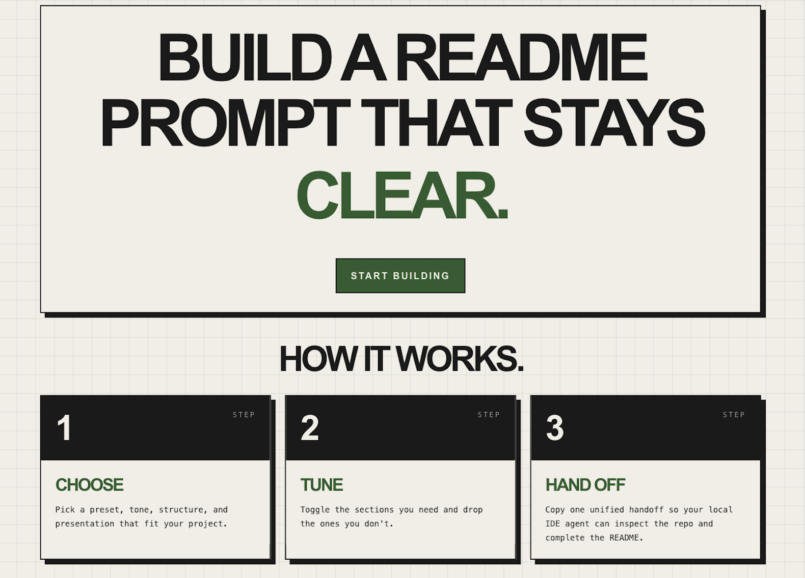
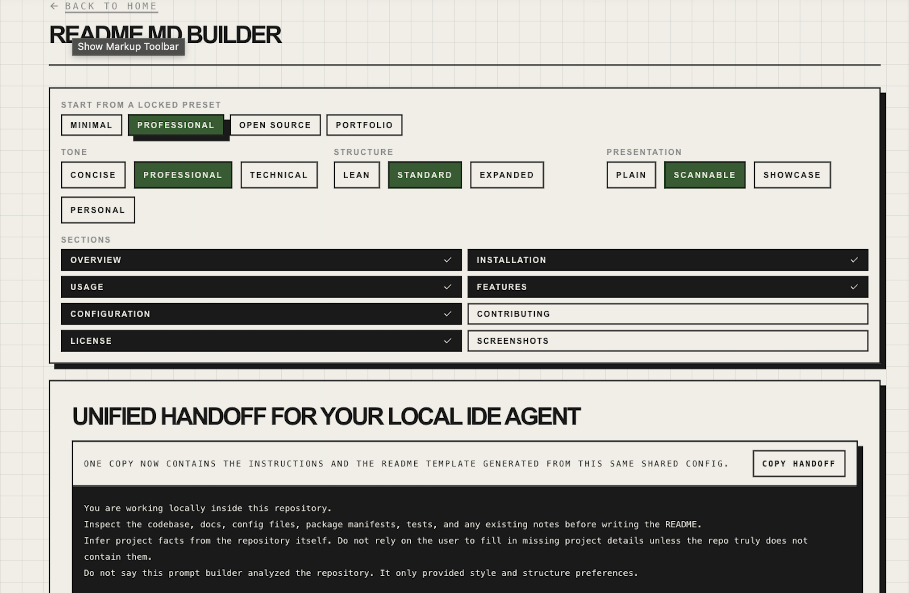

<a id="readme-top"></a>

# ReadmeCraft

> Generate a copy-ready README handoff that stays clear, local, and usable.

ReadmeCraft is a frontend-first README builder for developers who want to shape the structure and style of a `README.md` before handing the work off to a local IDE agent. Instead of filling in project facts manually, you choose a preset, tune the tone and structure, enable the sections you want, and copy one unified prompt that tells the local agent to inspect the target repository and write the final README.

[](https://github.com/Lucacas05/readmecraft)
[](https://react.dev/)
[](https://www.typescriptlang.org/)
[](https://vite.dev/)
[](https://tailwindcss.com/)

<!-- TABLE OF CONTENTS -->
<details>
  <summary>Table of Contents</summary>
  <ol>
    <li><a href="#overview">Overview</a></li>
    <li><a href="#built-with">Built With</a></li>
    <li><a href="#getting-started">Getting Started</a></li>
    <li><a href="#usage">Usage</a></li>
    <li><a href="#screenshots">Screenshots</a></li>
    <li><a href="#features">Features</a></li>
    <li><a href="#configuration">Configuration</a></li>
    <li><a href="#project-structure">Project Structure</a></li>
    <li><a href="#contributing">Contributing</a></li>
    <li><a href="#license">License</a></li>
  </ol>
</details>

## Overview

ReadmeCraft solves a specific workflow problem: you often know the kind of README you want, but you do not want to hand-author every section from scratch. This app lets you define the README direction first, then hand off a structured, copyable prompt to a local agent that can inspect the real repository and fill in the details.

The current app is a static React SPA with two routes:

- `/` presents the landing page and the three-step flow.
- `/builder` lets you configure the README and copy the unified handoff.

The builder does **not** claim to inspect the target repository itself. Its job is to generate the instructions and the embedded template; the local IDE agent is the part that reads the repo and writes the final `README.md`.

<p align="right">(<a href="#readme-top">back to top</a>)</p>

## Built With

- [React 18](https://react.dev/)
- [TypeScript](https://www.typescriptlang.org/)
- [Vite](https://vite.dev/)
- [Tailwind CSS](https://tailwindcss.com/)
- [React Router](https://reactrouter.com/)
- [Framer Motion](https://www.framer.com/motion/)
- [Vitest](https://vitest.dev/)
- [Testing Library](https://testing-library.com/)
- [Vercel Analytics](https://vercel.com/analytics)

<p align="right">(<a href="#readme-top">back to top</a>)</p>

## Getting Started

### Prerequisites

You need a local Node.js environment with npm available.

### Installation

1. Clone the repository:

   ```sh
   git clone https://github.com/Lucacas05/readmecraft.git
   cd readmecraft
   ```

2. Install dependencies:

   ```sh
   npm install
   ```

### Run locally

Start the Vite development server:

```sh
npm run dev
```

### Verify the project

Run the available checks:

```sh
npm test
npm run typecheck
npm run build
```

<p align="right">(<a href="#readme-top">back to top</a>)</p>

## Usage

### Typical workflow

1. Open the app and go to the builder.
2. Pick one of the locked presets: `Minimal`, `Professional`, `Open Source`, or `Portfolio`.
3. Tune the README direction with the available controls:
   - tone
   - structure
   - presentation
   - enabled sections
4. Copy the unified handoff from the prompt panel.
5. Paste that handoff into your local IDE agent **inside the target repository**.
6. Let the local agent inspect that repository and create or update its `README.md`.

### What the copied output contains

The copied handoff includes:

- instructions to inspect the repository locally
- rules for preserving an existing `README.md` when appropriate
- the selected preset/tone/structure/presentation choices
- an embedded README template shaped by the current filter state

### Example use cases

- Create a lean README for an internal tool.
- Generate a more complete open-source README with contribution guidance.
- Produce a showcase-style README for a portfolio project.
- Standardize README handoffs across projects without manually rewriting the same structure every time.

<p align="right">(<a href="#readme-top">back to top</a>)</p>

## Screenshots

<table>
  <tr>
    <td align="center">
      <br/>
      <sub><b>Landing</b> — editorial hero with a single path into the builder.</sub>
    </td>
  </tr>
  <tr>
    <td align="center">
      <br/>
      <sub><b>Builder</b> — preset, tone, structure, presentation, and section controls with the unified handoff panel.</sub>
    </td>
  </tr>
</table>

<p align="right">(<a href="#readme-top">back to top</a>)</p>

## Features

### README direction controls

- Four preset starting points: `Minimal`, `Professional`, `Open Source`, and `Portfolio`.
- Independent controls for tone, structure, and presentation.
- Toggleable sections with a guardrail that prevents disabling the final remaining section.

### Unified handoff generation

- Produces a single copyable output instead of splitting instructions and preview into separate artifacts.
- Embeds the README template directly inside the prompt.
- Tells the downstream agent to create or update `README.md` in the target repository.

### Better README scaffolding

- Generates a richer Best-README-inspired template structure.
- Adapts section content to the selected structure and presentation style.
- Supports features like optional table of contents and back-to-top links in the generated scaffold.

### Frontend-focused implementation

- No backend is required for the current MVP.
- State is managed locally with a reducer-backed React context.
- Prompt generation and README template generation are implemented as pure functions for easier testing.

### Tested behavior

The repository includes tests for:

- config reducer behavior
- prompt generation
- README template generation
- builder and landing page interactions

<p align="right">(<a href="#readme-top">back to top</a>)</p>

## Configuration

The current app does not document any required environment variables for local development.

Relevant runtime and behavior details verified in the repository:

| Setting area | Current state |
| --- | --- |
| App architecture | Frontend-only React SPA |
| Routing | `/` and `/builder` |
| State | Local React reducer + context |
| Output | Copyable unified prompt with embedded template |
| Analytics | `@vercel/analytics/react` is included in the app shell |

If you want to adapt the output behavior, the main places to look are:

- `src/data/presets.ts` for default preset definitions
- `src/lib/generate-prompt.ts` for the unified handoff text
- `src/lib/readme-template.ts` for the README scaffold that gets embedded in the prompt

<p align="right">(<a href="#readme-top">back to top</a>)</p>

## Project Structure

```text
src/
  components/
    configurator/   README controls
    landing/        landing page content
    output/         copyable prompt panel
    ui/             shared UI primitives
  data/             preset definitions
  lib/              prompt/template generators and shared copy
  pages/            landing and builder routes
  state/            README config reducer and provider
  types/            README config types

docs/READMEs/
  Best_README.md    reference template used as inspiration
  Hackathon.md      example README document

openspec/
  specs/            product/spec documentation for the app
```

<p align="right">(<a href="#readme-top">back to top</a>)</p>

## Contributing

This repository does not currently include a dedicated `CONTRIBUTING.md`, but the existing workflow is straightforward:

1. Install dependencies with `npm install`.
2. Make focused changes.
3. Run:

   ```sh
   npm test
   npm run typecheck
   npm run build
   ```

4. Open a pull request with the relevant context.

If you are changing the README generation flow, start by reviewing:

- `src/state/readme-config.tsx`
- `src/lib/generate-prompt.ts`
- `src/lib/readme-template.ts`
- `src/components/output/PromptPanel.tsx`

<p align="right">(<a href="#readme-top">back to top</a>)</p>

## License

This repository does **not** currently include a license file. Until one is added, reuse and distribution terms are not explicitly defined in the repo.

<p align="right">(<a href="#readme-top">back to top</a>)</p>
